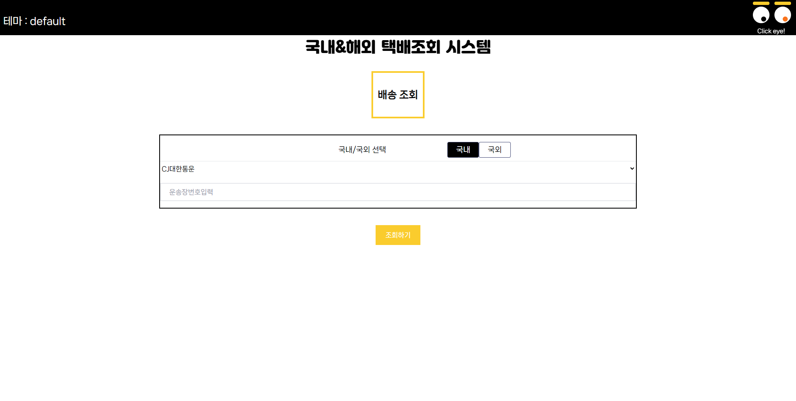

# 프로젝트 이름

   
  배송조회

  
   

## 프로젝트 소개

프로젝트 개요
 
택배조회 API를 사용하여 배송조회기능 구현 

 

## STACK

Vue
 
TailwindCSs
 
Axios
 
lottieplayer
 
animate

 

## 구현 기능

### 기능 1
운송장 번호를 입력하여 배송조회, 국내 및 국외 택배사 카테고리 제공
### 기능 2
테마를 클릭하여 페이지의 컬러테마를 변경할 수 있도록 구현
### 기능 3
animate, lottiefile 등을 사용하여 애니메이션 추가
### 기능 4
반응형 구현
 

 

